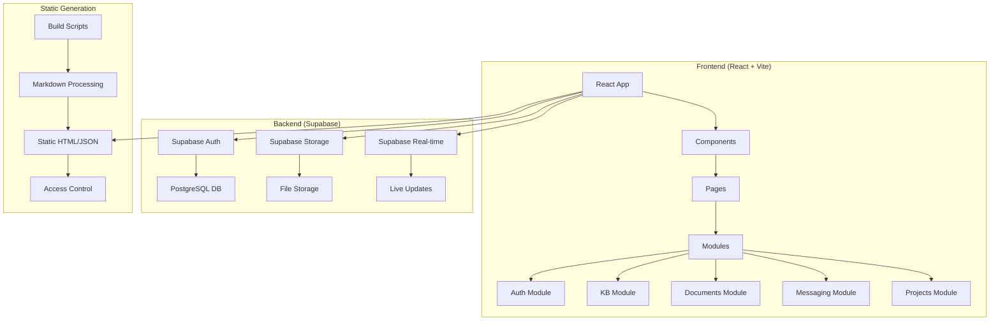

# QiAlly Portal - Development Seed File

## 🎯 Project Overview
**Goal:** Build a secure, all-in-one client portal for document management, messaging, knowledge base, and project management.

**Tech Stack:**
- Frontend: React 19.1.1 + Vite + TailwindCSS + Framer Motion
- Backend: Supabase (PostgreSQL + Auth + Real-time)
- Deployment: Cloudflare Pages
- Testing: Jest + React Testing Library
- Knowledge Base: Static site generation with access control

## 🏗️ Current Architecture

### System Architecture


### Database Schema
```sql
-- User profiles with role-based access
CREATE TABLE profiles (
    id UUID REFERENCES auth.users(id) PRIMARY KEY,
    email TEXT UNIQUE NOT NULL,
    full_name TEXT,
    client_slug TEXT,
    role TEXT DEFAULT 'client_user' CHECK (role IN ('admin', 'team_member', 'client_user')),
    created_at TIMESTAMP WITH TIME ZONE DEFAULT NOW(),
    updated_at TIMESTAMP WITH TIME ZONE DEFAULT NOW()
);

-- Knowledge base files with access control
CREATE TABLE kb_files (
    id UUID DEFAULT gen_random_uuid() PRIMARY KEY,
    client_slug TEXT NOT NULL,
    path TEXT NOT NULL,
    title TEXT NOT NULL,
    tags TEXT[],
    visibility TEXT DEFAULT 'private' CHECK (visibility IN ('public', 'private')),
    created_at TIMESTAMP WITH TIME ZONE DEFAULT NOW(),
    updated_at TIMESTAMP WITH TIME ZONE DEFAULT NOW()
);

-- Row Level Security Policies
ALTER TABLE profiles ENABLE ROW LEVEL SECURITY;
ALTER TABLE kb_files ENABLE ROW LEVEL SECURITY;

-- Users can view their own profile
CREATE POLICY "Users can view own profile" ON profiles
    FOR SELECT USING (auth.uid() = id);

-- Users can view their client KB files
CREATE POLICY "Users can view their client KB files" ON kb_files
    FOR SELECT USING (
        client_slug = (SELECT client_slug FROM profiles WHERE id = auth.uid())
        OR 
        (SELECT role FROM profiles WHERE id = auth.uid()) = 'admin'
    );

-- Admins can manage all KB files
CREATE POLICY "Admins can manage all KB files" ON kb_files
    FOR ALL USING ((SELECT role FROM profiles WHERE id = auth.uid()) = 'admin');
```

### API Structure
```
Authentication:
- POST /auth/login
- POST /auth/logout
- GET /auth/user
- POST /auth/reset-password

User Management:
- GET /api/users/profile
- PUT /api/users/profile
- GET /api/users/clients (admin only)
- POST /api/users/invite (admin only)

Knowledge Base:
- GET /kb/access-control.json
- GET /kb/{client}/index.html
- GET /kb/{client}/search-index.json
- GET /kb/{client}/articles/{slug}.html
- GET /kb/{client}/articles/{slug}.json

Documents:
- GET /api/documents
- POST /api/documents/upload
- GET /api/documents/{id}
- DELETE /api/documents/{id}

Messaging:
- GET /api/messages
- POST /api/messages
- GET /api/messages/{id}
- PUT /api/messages/{id}/read

Projects:
- GET /api/projects
- POST /api/projects
- GET /api/projects/{id}
- PUT /api/projects/{id}
- DELETE /api/projects/{id}
```

### Component Hierarchy
```
src/
├── App.jsx (Main router)
├── components/
│   ├── Layout/
│   │   ├── Sidebar.jsx
│   │   ├── Header.jsx
│   │   └── ProtectedRoute.jsx
│   ├── Auth/
│   │   ├── LoginForm.jsx
│   │   └── UserMenu.jsx
│   ├── KB/
│   │   ├── KBPortal.jsx
│   │   ├── KBAdmin.jsx
│   │   └── KBViewer.jsx
│   └── Common/
│       ├── Loading.jsx
│       └── ErrorBoundary.jsx
├── pages/
│   ├── Dashboard.jsx
│   ├── KB.jsx
│   ├── Documents.jsx
│   ├── Messages.jsx
│   ├── Projects.jsx
│   └── AdminPanel.jsx
├── lib/
│   ├── supabase.js
│   ├── auth.js
│   ├── kbApi.js
│   ├── staticKbApi.js
│   └── documents.js
└── modules/
    ├── auth/
    ├── kb/
    ├── documents/
    ├── messaging/
    └── projects/
```

## 📋 Prior Work Summary

### Completed Modules
- [x] Authentication System (Supabase Auth integration)
- [x] User Management (Role-based access control)
- [x] Knowledge Base (Static generation with access control)
- [ ] Document Management
- [ ] Messaging System
- [ ] Project Management

### Current Progress
**Phase:** Phase 3 - Knowledge Base System
**Module:** Static Knowledge Base Generation
**Status:** Completed - Ready for next module

### Recent Changes
- 2024-01-XX - Implemented static knowledge base generation system
- 2024-01-XX - Created build scripts for markdown processing
- 2024-01-XX - Added access control configuration
- 2024-01-XX - Built KB admin interface
- 2024-01-XX - Updated KB component to use static files
- 2024-01-XX - Created comprehensive development plan

### Known Issues
- TypeScript type annotations in JSX files causing linter errors
- Need to implement proper error boundaries
- Missing comprehensive test coverage
- Performance optimization needed for large markdown files

### Technical Debt
- Convert JSX files to TypeScript (.tsx)
- Implement proper state management (Context API or Redux)
- Add comprehensive error handling
- Implement proper loading states
- Add accessibility features (ARIA labels, keyboard navigation)

## 🎯 Next Steps

### Immediate Tasks
1. **Document Management Module** - Implement file upload, storage, and access control
2. **Fix TypeScript Issues** - Convert components to proper TypeScript
3. **Add Testing Framework** - Set up Jest and React Testing Library
4. **Performance Optimization** - Implement lazy loading and code splitting

### Upcoming Milestones
- **Document Management** - Target: 2-3 weeks
- **Messaging System** - Target: 2-3 weeks
- **Project Management** - Target: 3-4 weeks
- **Integration Testing** - Target: 1-2 weeks

## 🔧 Development Environment

### Local Setup
```bash
# Commands to run the project
npm install
npm run dev
npm run build:kb
npm run build:all
npm run deploy:kb
npm run deploy:kb-full
```

### Environment Variables
```env
VITE_SUPABASE_URL=your_supabase_url
VITE_SUPABASE_ANON_KEY=your_supabase_anon_key
```

### Testing Commands
```bash
npm test
npm run test:integration
npm run test:e2e
```

## 📚 Documentation Links
- [README.md](./README.md)
- [DEVELOPMENT_PLAN.md](./DEVELOPMENT_PLAN.md)
- [WORKFLOW_GUIDE.md](./WORKFLOW_GUIDE.md)
- [KB_DATABASE_SETUP.sql](./KB_DATABASE_SETUP.sql)

## 🚀 Current Module: Document Management

### Requirements
- File upload with drag-and-drop interface
- File organization and categorization
- Access control based on user roles and client membership
- File preview and download functionality
- Search and filtering capabilities
- Version control and audit trail

### Technical Specifications
- **Storage:** Supabase Storage with RLS policies
- **File Types:** PDF, DOC, DOCX, XLS, XLSX, PPT, PPTX, Images
- **Max File Size:** 50MB per file
- **Security:** Client-specific access control
- **Performance:** Lazy loading and pagination

### Implementation Plan
1. **Database Schema** - Create documents table with RLS policies
2. **Storage Bucket** - Set up Supabase Storage with access control
3. **API Layer** - Implement document CRUD operations
4. **UI Components** - Build upload, list, and viewer components
5. **Integration** - Connect with existing authentication system
6. **Testing** - Unit and integration tests

## 🔒 Security Considerations

### Authentication & Authorization
- JWT tokens for API authentication
- Role-based access control (admin, team_member, client_user)
- Client-specific data isolation
- Row-level security policies in database

### Data Protection
- File encryption at rest
- Secure file upload validation
- Audit logging for all operations
- Regular security audits

### Compliance
- GDPR compliance for data privacy
- SOC 2 compliance framework
- Regular vulnerability assessments
- Data backup and recovery procedures

---

**Last Updated:** 2024-01-XX
**Next Review:** 2024-01-XX
**Current Sprint:** Document Management Module
