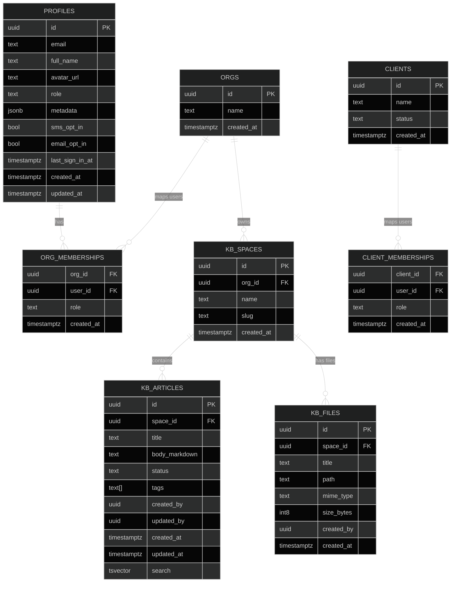

# QiPortals Knowledge Base — Public Schema

This is the source-of-truth Markdown for the **public** schema that powers the multi‑tenant Knowledge Base. It includes:
- A human‑readable table catalog
- A Mermaid ER diagram
- A ready‑to‑save **Obsidian Canvas** JSON at the end that visually links each table node (you can drop it into your vault as `QiPortals_KB_Schema.canvas`).

---

## Mermaid ER Overview


---

## Table Catalog

### 1) `profiles`
**Purpose**: App‑level user profile mirrored to `auth.users`.

| column | type | notes |
|---|---|---|
| `id` | uuid PK | equals `auth.users.id` |
| `email` | text | optional cache of auth email |
| `full_name` | text |  |
| `avatar_url` | text |  |
| `role` | text | app role: `admin`, `team_member`, `client_user` |
| `metadata` | jsonb | open extension field |
| `sms_opt_in` | bool |  |
| `email_opt_in` | bool |  |
| `last_sign_in_at` | timestamptz |  |
| `created_at` | timestamptz default now() |  |
| `updated_at` | timestamptz default now() | trigger/edge updates |

**Indexes**: `pk(id)`; add `unique(email)` if you want.

**RLS**: ON → `id = auth.uid()` for self‑read/write; admins via service role.

---

### 2) `orgs`
**Purpose**: A tenant/client container.

| column | type | notes |
|---|---|---|
| `id` | uuid PK default gen_random_uuid() |  |
| `name` | text not null unique |  |
| `created_at` | timestamptz default now() |  |

**Indexes**: `unique(name)`

**RLS**: ON → readable by members (via `org_memberships`).

---

### 3) `org_memberships`
**Purpose**: Connects users to orgs with a role.

| column | type | notes |
|---|---|---|
| `org_id` | uuid FK → orgs(id) on delete cascade |  |
| `user_id` | uuid FK → profiles(id) | = `auth.users.id` |
| `role` | text check in (`owner`,`admin`,`editor`,`viewer`) |  |
| `created_at` | timestamptz default now() |  |

**PK**: `(org_id, user_id)`  
**Indexes**: `(user_id, org_id)`

**RLS**: ON → `select` where `user_id = auth.uid()`.

---

### 4) `kb_spaces`
**Purpose**: Sections within an org’s KB (e.g., General, Legal).

| column | type | notes |
|---|---|---|
| `id` | uuid PK default gen_random_uuid() |  |
| `org_id` | uuid FK → orgs(id) on delete cascade |  |
| `name` | text not null |  |
| `slug` | text not null | unique per org |
| `created_at` | timestamptz default now() |  |

**Unique**: `(org_id, slug)`  
**Indexes**: `(org_id, slug)`

**RLS**: ON → `select` any member; `insert/update/delete` roles `owner/admin`.

---

### 5) `kb_articles`
**Purpose**: Markdown content for the KB.

| column | type | notes |
|---|---|---|
| `id` | uuid PK default gen_random_uuid() |  |
| `space_id` | uuid FK → kb_spaces(id) on delete cascade |  |
| `title` | text not null |  |
| `body_markdown` | text not null default '' |  |
| `status` | text default 'published' check in (`draft`,`published`,`archived`) |  |
| `tags` | text[] default '{}' |  |
| `created_by` | uuid not null | auth user |
| `updated_by` | uuid | auth user |
| `created_at` | timestamptz default now() |  |
| `updated_at` | timestamptz default now() |  |
| `search` | tsvector | via trigger on title/body/tags |

**Indexes**: `gin(search)`, `(space_id)`, `(updated_at desc)`

**RLS**: ON → `select` any member; `insert/update` roles `owner/admin/editor`; `delete` roles `owner/admin`.

---

### 6) `kb_files`
**Purpose**: File metadata; file bytes live in Storage `kb` bucket.

| column | type | notes |
|---|---|---|
| `id` | uuid PK default gen_random_uuid() |  |
| `space_id` | uuid FK → kb_spaces(id) on delete cascade |  |
| `title` | text |  |
| `path` | text not null | `org/<org_id>/kb/<space_id>/<uuid>/<filename>` |
| `mime_type` | text |  |
| `size_bytes` | bigint |  |
| `created_by` | uuid not null |  |
| `created_at` | timestamptz default now() |  |

**Indexes**: `(space_id)`  
**RLS**: ON → `select` any member; `insert/update/delete` roles `owner/admin/editor`.

---

### 7) `clients` & `client_memberships` (optional layer)
For agencies that manage multiple *client accounts* inside an org.

**clients**
| column | type |
|---|---|
| `id` uuid PK | `name` text | `status` text | `created_at` timestamptz |

**client_memberships**
| column | type |
|---|---|
| `client_id` uuid | `user_id` uuid | `role` text | `created_at` timestamptz |

RLS mirrors the `org_*` pattern if used.

---

## Storage (private bucket: `kb`)
- **Path convention:** `org/<org_id>/kb/<space_id>/<uuid>/<filename>`
- **Policies:**
  - `kb_read_org_members` (SELECT → `{authenticated}`) + path check + org membership
  - `kb_write_org_editors` (INSERT → `{authenticated}`) + path check + role in `owner/admin/editor`
  - Optional `UPDATE/DELETE` analogs for editors

---

## Obsidian Canvas JSON (save as `QiPortals_KB_Schema.canvas`)
> Tip: Create separate Markdown notes named after each table (e.g., `public_orgs.md`, `public_kb_spaces.md`). This canvas links to those filenames; adjust paths as needed.

```json
{
  "nodes": [
    {"id":"orgs","type":"file","file":"public_orgs.md","x":-400,"y":-60,"width":240,"height":120,"color":"2"},
    {"id":"org_memberships","type":"file","file":"public_org_memberships.md","x":-120,"y":160,"width":280,"height":120,"color":"2"},
    {"id":"kb_spaces","type":"file","file":"public_kb_spaces.md","x":80,"y":-60,"width":260,"height":120,"color":"4"},
    {"id":"kb_articles","type":"file","file":"public_kb_articles.md","x":420,"y":-60,"width":280,"height":140,"color":"4"},
    {"id":"kb_files","type":"file","file":"public_kb_files.md","x":420,"y":200,"width":260,"height":120,"color":"4"},
    {"id":"profiles","type":"file","file":"public_profiles.md","x":-420,"y":-300,"width":280,"height":160,"color":"1"},
    {"id":"clients","type":"file","file":"public_clients.md","x":-480,"y":200,"width":260,"height":120,"color":"3"},
    {"id":"client_memberships","type":"file","file":"public_client_memberships.md","x":-740,"y":200,"width":300,"height":120,"color":"3"}
  ],
  "edges": [
    {"id":"e1","fromNode":"profiles","toNode":"org_memberships","fromSide":"right","toSide":"left","label":"profiles.id → org_memberships.user_id"},
    {"id":"e2","fromNode":"orgs","toNode":"org_memberships","fromSide":"right","toSide":"left","label":"orgs.id → org_memberships.org_id"},
    {"id":"e3","fromNode":"orgs","toNode":"kb_spaces","fromSide":"right","toSide":"left","label":"orgs.id → kb_spaces.org_id"},
    {"id":"e4","fromNode":"kb_spaces","toNode":"kb_articles","fromSide":"right","toSide":"left","label":"kb_spaces.id → kb_articles.space_id"},
    {"id":"e5","fromNode":"kb_spaces","toNode":"kb_files","fromSide":"right","toSide":"left","label":"kb_spaces.id → kb_files.space_id"},
    {"id":"e6","fromNode":"profiles","toNode":"kb_articles","fromSide":"bottom","toSide":"top","label":"profiles.id → created_by/updated_by"},
    {"id":"e7","fromNode":"clients","toNode":"client_memberships","fromSide":"right","toSide":"left","label":"clients.id → client_memberships.client_id"},
    {"id":"e8","fromNode":"profiles","toNode":"client_memberships","fromSide":"left","toSide":"right","label":"profiles.id → client_memberships.user_id"}
  ]
}
```

---

## Notes & Conventions
- **RLS**: ON for `orgs`, `org_memberships`, `kb_spaces`, `kb_articles`, `kb_files`.
- **Search**: Postgres FTS now (`tsvector` + GIN) with an easy upgrade path to `pgvector` later.
- **Naming**: `snake_case` for tables/columns; plurals for tables.
- **Storage**: All KB files live under `kb` bucket with the enforced prefix.

---

## Roadmap (tiny steps)
1. Mirror this Markdown into your Obsidian vault as individual notes per table (use the exact filenames referenced in the Canvas JSON).
2. Drop the Canvas JSON as `QiPortals_KB_Schema.canvas` in the same folder for a clickable, visual map.

> When ready, I’ll add a **pgvector** section + indexer job spec and the small admin UI fields (status/tags) to round out content workflows.

